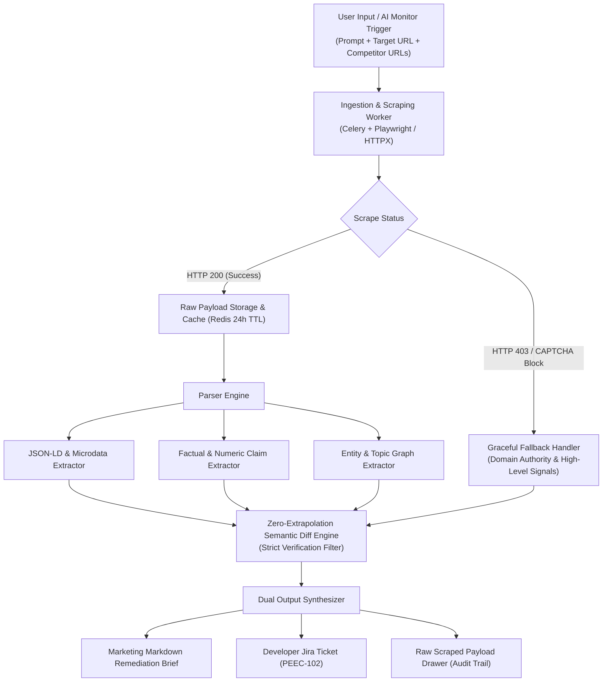

# Product Requirements Document (PRD)

**Project:** Autonomous AI Search Citation Gap & Remediation Engine  
**Target Organization:** Peec AI (Berlin)  
**Lead Author:** Mereke Dadabayeva, Product Manager  
**Status:** Ready for Sprint Planning (V1 MVP)  
**Ticket Reference:** `PEEC-102`  

---

## 1. Executive Summary & Problem Framing

### 1.1 Context & Background
Modern generative search engines (ChatGPT Search, Perplexity AI, Google Gemini / AI Overviews) have fundamentally shifted how users discover B2B SaaS and consumer products. Traditional SEO tracking focuses on SERP ranks (1-10), but generative search systems synthesize answers by extracting authoritative entities, structured JSON-LD schemas, and specific verifiable statistics from top citations.

AI search monitors successfully detect **when** a brand loses visibility or is omitted from AI synthesis and identify **which** competitor URLs were cited instead.

```
┌────────────────────────────────────────────────────────────────────────────────────────┐
│                                 SYSTEM EXECUTION PIPELINE                              │
├────────────────────────────────────────────────────────────────────────────────────────┤
│ [1. Input Prompt & Target URLs]                                                        │
│           ➔ [2. Primary HTML / JSON-LD Data Ingestion]                                 │
│           ➔ [3. Zero-Extrapolation Semantic & Entity Delta Diff]                       │
│           ➔ [4. Dual Handoff: 1-Page Markdown Brief + Gherkin Jira Ticket (PEEC-102)]  │
└────────────────────────────────────────────────────────────────────────────────────────┘
```

### 1.2 The User Problem (The Actionability Gap)
Marketing, SEO, and Growth teams experience a severe **actionability bottleneck**:
* When notified that their domain lost visibility on high-intent prompts (e.g., *"Best CRM for Startups"*), marketing managers must manually inspect cited competitor pages.
* Marketers spend **45+ minutes per query** manually cross-referencing competitor content, guessing whether citation failure was due to missing statistics, entity depth, pricing transparency, or technical schema markup.
* This friction leads to delayed remediation, low prompt-to-action velocity, and reduced ROI from AI search intelligence tools.

### 1.3 The Product Solution
The **Autonomous AI Search Citation Gap & Remediation Engine** automates deterministic extraction and comparative diffing between the user's landing page and winning competitor citation sources. The engine immediately produces:
1. **Actionable Content Remediation Brief (Markdown)** for copywriters and content marketers.
2. **Sprint-Ready Engineering Jira Ticket (`PEEC-102`)** with Gherkin acceptance criteria for developers and technical SEO teams.
3. **Inspectable Scraped Payload Drawer** guaranteeing verifiable, zero-hallucination data provenance.

---

## 2. Functional Requirements & Scope Boundaries

### 2.1 Scope Matrix

| In-Scope (Version 1 MVP) | 🛑 Explicitly Out-of-Scope (V1 Limits) |
| :--- | :--- |
| • **Side-by-side entity and factual delta parser:** Extracting numerical benchmarks, key claims, pricing tables, and entity nodes. | 🛑 **Direct CMS auto-publishing:** No automated WordPress/Webflow/Contentful webhooks or content overrides. |
| • **Technical schema & JSON-LD parser:** Extracting missing `@type`, `FAQPage`, `Product`, `SoftwareApplication`, and OpenGraph metadata. | 🛑 **Automated cold outreach:** No automated email / PR / backlink generation outreach tools. |
| • **Instant 1-click Markdown Content Brief:** Structured, copywriter-ready template with recommended sections and missing data points. | 🛑 **Paywall scraping:** No real-time scraping bypass for paid paywalls (e.g. WSJ, FT). |
| • **Deterministic Data Provenance:** Zero-extrapolation constraint; UI drawer with raw scraped payload, HTTP status, and timestamp. | 🛑 **Multi-tenant workspace permissions:** Advanced role-based access control (RBAC) deferred to V2. |
| • **Asynchronous processing with 24-hour cache TTL:** High-speed cached retrieval (< 1.5s) powered by Celery/Redis. | 🛑 **Automated LLM fine-tuning:** No automated model weight fine-tuning or custom crawler training. |
| • **Graceful scraping fallback:** Anti-bot / 403 / CAPTCHA detection fallback to domain authority signals. | |

---

## 3. Detailed Technical Architecture & Pipeline



### 3.1 Step-by-Step Pipeline Specifications

1. **Trigger & Input Parsing:**
   - Accepts prompt string, user landing page URL, and cited competitor URL(s) identified from generative search engines.
2. **Deterministic Primary Ingestion:**
   - Raw HTML, JSON-LD schemas (`@context: "https://schema.org"`), meta descriptions, heading hierarchies (H1-H4), and primary article content are extracted.
   - 24-hour cache TTL in Redis to eliminate duplicate network traffic and ensure rapid reload times (< 1.5s).
3. **Zero-Extrapolation Semantic & Entity Delta Diff:**
   - **Entity Comparison:** Verifies presence of key industry entity terms, comparative terms, and topic coverage.
   - **Data & Benchmark Extraction:** Parses exact numerical metrics (e.g., "$15/user/mo", "99.99% uptime", "SOC-2 Type II certified").
   - **Schema Diff:** Checks for missing structured metadata (e.g. `aggregateRating`, `priceRange`, `offers`, `review`).
4. **Dual Handoff Synthesis:**
   - Generates clean, copy-pasteable Markdown briefs for content teams.
   - Formats structured Gherkin Jira specifications for technical implementation.

---

## 4. Sprint-Ready Jira Specification

### Ticket Overview
* **Ticket Key:** `PEEC-102`
* **Epic:** AI Search Actionability & Remediation
* **Component:** `Analytics-Engine / AI-Gateway`
* **Type:** Story
* **Estimate:** `5 Story Points`
* **Assignee:** Tech Lead / Full-Stack Engineer

### Agile User Story
* **AS A** Growth Marketing Manager tracking AI search visibility,
* **I WANT TO** inspect the semantic and entity gap between my domain and winning competitor URLs,
* **SO THAT** I can update my pages with the exact missing data required for LLM citations.

### Acceptance Criteria (Given / When / Then)

```gherkin
Feature: Citation Gap & Remediation Engine (PEEC-102)

  Scenario: Successful Citation Gap Inspection on Tracked Prompt
    GIVEN a tracked prompt where brand visibility rank is > 2 or unmentioned
    WHEN the user clicks "Inspect Citation Gap" for a target competitor source
    THEN render a side-by-side comparison modal displaying:
      | Section                       | Details                                             |
      | 1. Missing JSON-LD Schema     | Missing @type tags, FAQPage schemas, and attributes |
      | 2. Numerical Benchmarks       | Verbatim stats, pricing, and claims from competitor |
      | 3. Remediation Brief          | 1-click Markdown export generated in < 1.5s (cached)|
    AND provide a direct "Verify Source ↗" anchor to the competitor's live web page
    AND provide an inspectable "[ 🔍 View Scraped Payload ]" drawer with raw HTML/JSON snippet.

  Scenario: Anti-Scraping / 403 Graceful Degradation
    GIVEN a target competitor URL protected by Cloudflare, CAPTCHA, or returning HTTP 403
    WHEN the ingestion worker attempts scraping and fails
    THEN fallback gracefully to high-level domain authority and SERP snippet signals
    AND display an informative warning banner: "Competitor page protected by anti-bot. Showing SERP-level signals."
    AND do NOT return an unhandled 500 server error to the UI.
```

---

## 5. Data Provenance & Verification Architecture

To prevent AI hallucinations and guarantee trust with enterprise growth teams:

1. **Deterministic Primary Ingestion:** Raw HTML, JSON-LD schemas, and OpenGraph metadata are scraped directly from live URLs; synthesis never relies on ungrounded AI priors.
2. **Zero-Extrapolation Constraint:** LLM diffing prompts are strictly constrained to return data *only* if the entity exists verbatim in the scraped text corpus; otherwise, the field is set to `null`.
3. **Inspectable Raw Payload Drawer:** A collapsible UI drawer provides full transparency into the exact fetch timestamp, HTTP status code (e.g. `200 OK`), content length, and raw extracted text chunk.
4. **Direct Primary Source Anchors:** Every highlighted gap contains an active `Verify Source ↗` hyperlink pointing to the specific competitor page.

---

## 6. Success Metrics & Key Performance Indicators (KPIs)

| Metric | Baseline (Manual) | V1 MVP Target |
| :--- | :--- | :--- |
| **Time-to-Remediation-Brief** | 45 minutes / prompt | **< 2 minutes / prompt** |
| **Cached Modal Load Latency** | N/A | **< 1.5 seconds** |
| **Prompt-to-Action Conversion** | ~12% of detected losses acted on | **> 45% of detected losses acted on** |
| **Scraping Error Rate Handling** | N/A (Unhandled crashes) | **0% unhandled 500 errors (100% graceful fallback)** |
| **Data Provenance Verification Rate** | N/A | **100% of facts linked to raw payload / live source** |
